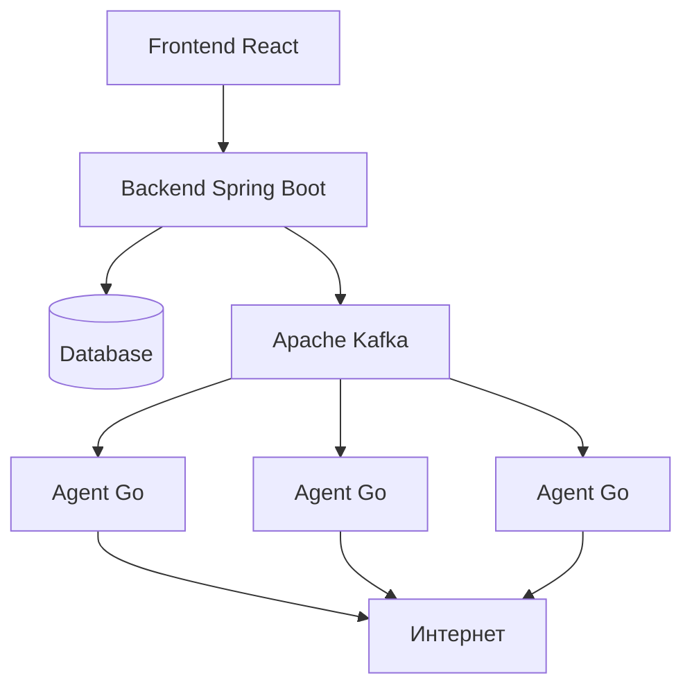

# 🌐 Aeza Hostmaster - Сервис проверки хостов и DNS резолвинга

[](https://openjdk.org/)
[](https://spring.io/)
[](https://reactjs.org/)
[](https://golang.org/)
[](https://kafka.apache.org/)
[](https://docker.com/)

**Мощная распределенная система для мониторинга доступности сервисов и DNS-диагностики из разных точек мира**

---

## 🚀 Возможности

### 🔍 Проверки доступности
- **HTTP/HTTPS** - статус коды, заголовки, время ответа
- **PING** - проверка доступности по ICMP
- **TCP Port** - проверка открытых портов
- **Traceroute** - трассировка маршрута
- **DNS Lookup** - A, AAAA, MX, NS, TXT записи

### 🌍 Распределенная архитектура
- **Агенты в разных странах** - проверки из различных географических точек
- **Масштабируемость** - легко добавлять новые агенты
- **Real-time обновления** - WebSocket для мгновенных результатов

### 📊 Мониторинг и аналитика
- **Визуализация на картах** - GeoIP для traceroute и расположения хостов
- **История проверок** - хранение и сравнение результатов
- **Метрики агентов** - доступность, задержки, статистика

---

## 🏗 Архитектура системы



### Компоненты системы

| Компонент | Технология | Назначение |
|-----------|------------|------------|
| **Frontend** | React + TypeScript | Веб-интерфейс для управления проверками |
| **Backend** | Spring Boot + Java 21 | REST API, управление задачами, аутентификация |
| **Agents** | Go 1.21 | Выполнение сетевых проверок из разных локаций |
| **Message Queue** | Apache Kafka | Асинхронная обработка задач проверок |
| **Database** | PostgreSQL | Хранение результатов и метаданных |
| **Containerization** | Docker + Docker Compose | Простое развертывание |

---

## 🛠 Быстрый старт

### Предварительные требования
- Docker 24.0+
- Docker Compose
- Git
- Kafka

### Запуск всей системы

```bash
# Клонирование репозитория
git clone https://github.com/your-org/aeza-hostmaster
cd aeza-hostmaster

# Запуск всех сервисов
docker-compose up -d

# Проверка статуса
docker-compose ps
```

Система будет доступна:
- **Frontend**: http://localhost:3000
- **Backend API**: http://localhost:8080
- **API Docs**: http://localhost:8080/swagger_ui/index.html

---

## 🤖 Регистрация агента

### 1. Ручная регистрация через API
```bash
curl -X POST http://localhost:8080/api/agents/register \
  -H "Content-Type: application/json" \
  -d '{
    "agentName": "europe-agent-01",
    "ipAddress": "192.168.1.100",
    "country": "DE"
  }'
```

### 3. Запуск агента
```bash
# Скачайте бинарный файл агента
git clone https://sourcecraft.dev/hmae/agent-aeza

cd agent-aeza

# Отредактируйте переменные, либо добавьте AGENT_NAME, AGENT_TOKEN, AGENT_COUNTRY в .env
nano docker-compose.yaml

# Запустите агент
docker compose up -d && docker compose logs -f 
```

---


## 🔧 Основные репозитории

### Backend
https://sourcecraft.dev/hmae/aeza-hostmaster

###  Frontend
https://sourcecraft.dev/hmae/aeza-hostmaster

###  Agent
https://sourcecraft.dev/hmae/agent-aeza

### Тестирование
```bash
# Backend тесты
cd backend && ./gradlew test
```


---

## 🔐 Безопасность

- **Аутентификация агентов** - Basic Auth
- **Валидация входных данных** - защита от инъекций
- **Изоляция агентов** - Docker для безопасности

---

## 🆘 Поддержка

- 📧 Email: hutornoyaa@gmail.com
- 💬 Telegram: @Siderean
- 🐛 [Issues](https://github.com/SidereaH/Aeza-HostMaster/issues)
- 📚 [Документация](https://138.124.14.169:8080/api/docs)

---

## 🏆 Команда проекта

Разработано с ❤️ by Team78&& для хакатона **Хакатон Осень 2025**


---

<div align="center">

**⭐ Если вам нравится проект, поставьте звезду на GitHub!**

[](https://aeza.net)
[](https://sourcecraft.dev)

</div>